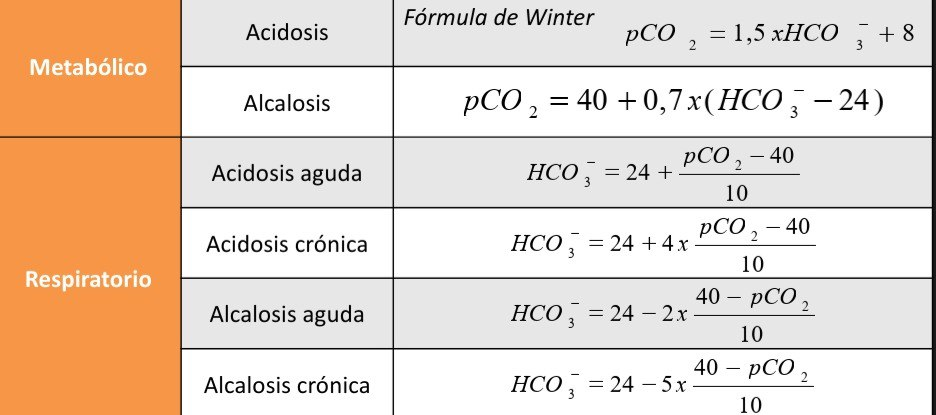
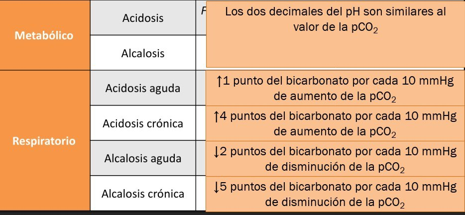

Sistemática de análisis del Estado Ácido-Base

## Ver el pH

**¿Ácido, alcalino o normal (7.35-7.45)?**

Recordar: que el pH sea normal, no descarta la presencia de un trastorno ácido-base. Por otro lado, la compensación de los trastornos del EAB **no** deriva en un pH normal, con lo que un pH normal en el contexto de un trastorno del EAB suele implicar la presencia de un *trastorno mixto opuesto*.

## Ver la pCO2

**¿Explica la pCO2 el trastorno en el pH?**

Una pCO2 elevada (>40 mmHg) puede corresponder con una acidosis respiratoria, mientras que una disminuida (<35 mmHg), con una alcalosis respiratoria (o bien con la corrección de los trastornos metabólicos opuestos)

- pH bajo con pCO2 elevada = acidosis respiratoria
- pH bajo con pCO2 disminuida = acidosis metabólica
- pH elevado con pCO2 elevada = alcalosis metabólica
- pH elevado con pCO2 disminuida = alcalosis respiratoria
- pH normal con pCO2 elevada = acidosis respiratoria + alcalosis metabólica
- pH normal con pCO2 disminuida = alcalosis respiratoria + acidosis metabólica

## Ver el bicarbonato (HCO3)

**¿Se confirma el trastorno primario?**

A esta altura deberíamos tener identificado el trastorno primario presente, y podemos confirmarlo viendo el bicarbonato. 

Calcular el *delta HCO3: 24-\[HCO3]*. Después lo vamos a comparar con el delta GAP.

## Calcular la compensación

La presencia de alteraciones en la compensación (en más o en menos) nos define los trastornos secundarios: cuando "corrige de más" se presentan los trastornos mixtos opuestos (acidosis + alcalosis), y cuando "se corrige de menos" los trastornos mixtos (acidosis o alcalosis respiratoria + metabólica).

## Calcular el anión GAP

**Na-Cl-HCO3 = anión GAP**

Es normal hasta 12. La presencia de un GAP elevado implica una acidosis metabólica. Está compuesto por ácidos que habitualmente no se miden en el EAB y ionograma habituales (Cl, pCO2): lactato, cetoácidos, fosfato, etc. Las acidosis metabólicas pueden dividirse en hiperclorémicas (GAP normal) o a GAP elevado (normoclorémicas), lo que permite terminar de definir el trastorno primario. Las acidosis hiperclorémicas suelen depender de pérdidas de bicarbonato (por ejemplo en la diarrea) o por un aporte excesivo de cloro (por ejemplo en la reanimación de un shock con solución fisiológica).

Calcular el *delta GAP: anión GAP - 12*. Comparar con el delta HCO3:

- delta GAP > delta HCO3: presencia de una alcalosis metabólica concurrente
- delta GAP < delta HCO3: presencia de una acidosis metabólica hiperclorémica concurrente
- delta GAP = delta HCO3: acidosis metabólica a GAP elevado pura

> Como dato accesorio, el Cl normalmente es un ~70% del Na: cuando hay más, suele haber un componente de hipercloremia (acidosis), y si hay menos, un componente de alcalosis metabólica.

Estos son trastornos terciarios.
