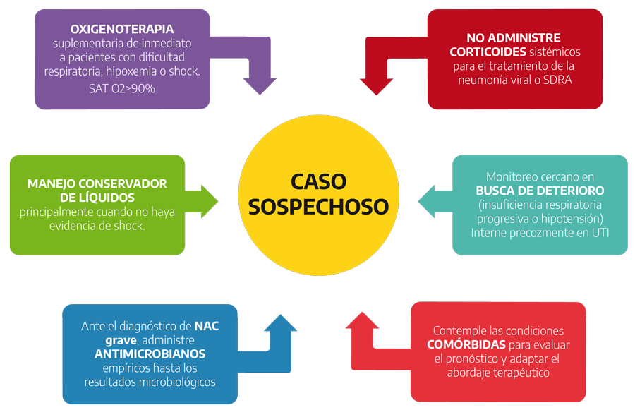
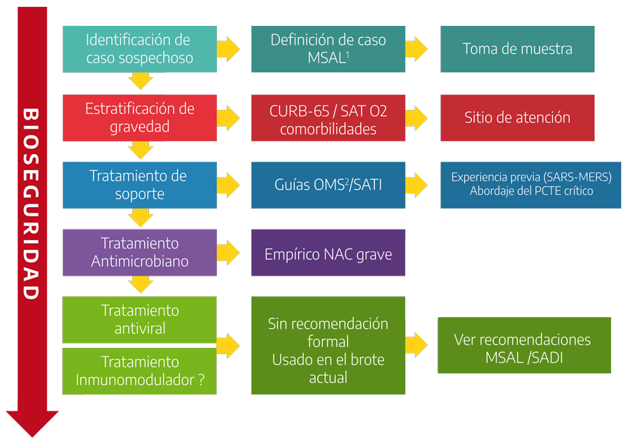
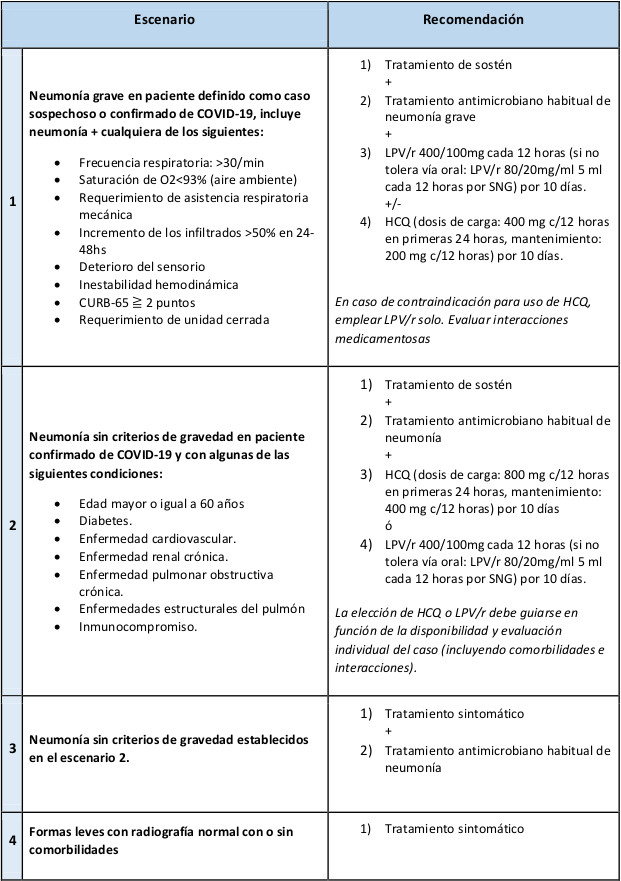

REVISIÓN COVID-19 

# Definición de caso, sintomatología y diagnóstico

## Definición de caso

Se actualiza en forma dinámica según la situación epidemiológica: [https://www.argentina.gob.ar/salud/coronavirus-COVID-19/definicion-de-caso](https://www.argentina.gob.ar/salud/coronavirus-COVID-19/definicion-de-caso)

## Clínica

La clínica se ha dividido en cuadros leves, severos, y críticos ([fuente](https://doi.org/10.1002/jmv.25766)):

- Tipo leve: sin neumonía o neumonía leve
- Tipo severo: disnea, FR >30/min, SpO2 <94%, PaFi <300, y/o infiltrados pulmonares >50% en 24-48hs.
- Tipo crítico: insuficiencia respiratoria aguda, shock séptico, y/o falla multiorgánica

Los síntomas más habituales son fiebre, tos seca y disnea. Presentaciones menos habituales incluyen la producción de esputo y cuadros de diarrea.

La fiebre, si bien es el hallazgo más frecuente, no es constante: un 2% de los pacientes en general no presentó fiebre, y un 4% de los pacientes que no requieren UTI no presentan fiebre [en un estudio sobre la población de Wuhan](https://doi.org/10.1016/S0140-6736\(20\)30183-5); y en una [cohorte](https://doi.org/10.1016/S2213-2600\(20\)30079-5) de pacientes que requirieron UTI, la fiebre inició luego de 2 días de iniciados los primeros síntomas en un 11%.

En su evolución la fiebre tiende a resolver para la segunda semana, donde comienzan las complicaciones en aquellos pacientes con mala evolución ([fuente](https://doi.org/10.1016/S0140-6736(20)30566-3)).

([Ver figura](https://els-jbs-prod-cdn.jbs.elsevierhealth.com/cms/attachment/c04d5964-182e-4cc3-aa16-ced4a69ba380/gr1.jpg))

Mientras que inicialmente la clínica depende directamente de la extensión de la infección viral, con la evolución del cuadro la respuesta inflamatoria del paciente comienza a jugar un rol en la patogénesis de las complicaciones: SDRA, sepsis y shock séptico, falla de bomba.

Se ha [propuesto](https://doi.org/10.1016/j.healun.2020.03.012) una clasificación en etapas de la enfermedad:

[Ver figura](https://marlin-prod.literatumonline.com/cms/attachment/16b6c896-8d57-4844-b6f6-18192a215304/gr1_lrg.jpg)

- **I - Infección temprana.** Fiebre y síntomas generales, tos, diarrea, cefalea. Aparecen la linfopenia, elevación de LDH y dímero D. Fisiopatológicamente: fase de respuesta viral. Es en esta fase donde probablemente jueguen un rol preponderante los tratamientos específicos antivirales, y evitando el uso de inmunosupresores como los corticoides
- **II - Fase pulmonar.** Aparece la disnea, y manifestaciones imagenológicas. Puede haber alteración del hepatograma. Implica la transición hacia la fase de respuesta inflamatoria.
  - *IIa - Sin hipoxia.*
  - *IIb - Con hipoxia.* Aparece la hipoxia (PaFi <300) 
- **III - Fase hiperinflamatoria.** Aparición de SDRA, sepsis y shock, insuficiencia cardíaca. Mayor elevación de marcadores inflamatorios (PCR, LDH, dímero D, ferritina), troponinas. Es en esta fase donde podrían tener un rol los tratamientos inmunosupresores como los corticoides.

## Diagnóstico de laboratorio

Actualmente [en Argentina](https://www.argentina.gob.ar/salud/coronavirus-COVID-19/laboratorio) se realiza RT-PCR, en particular de muestras oro y nasofaríngeas. Si bien la PCR resultó ser un método específico, hay evidencia de baja sensibilidad, siendo variable el rédito según el[origen de la muestra](https://doi.org/10.1001/jama.2020.3786) (tiene más tasa de positivos en muestras de vía aérea baja, con falsos negativos hasta en un 40% de muestras nasales), lo que llevó a que sea necesario considerar la clínica y otras posibles etiologías antes de desaislar al paciente; en estos casos pueden resultar útiles los hallazgos en la TC de tórax ([hay evidencia](https://dx.doi.org/10.2139/ssrn.3546086) que la combinación de TC+PCR logra mayor sensibilidad que la PCR aislada).

## El rol del diagnóstico por imágenes 

En un [reporte](https://pubmed.ncbi.nlm.nih.gov/32101510) de 1014 casos, el uso de hallazgos característicos en la TC identificó pacientes con COVID-19 con un 97% de sensibilidad (comparando con la PCR), pero con baja especificidad (75% de pacientes con PCR negativa tuvieron una TC positiva).

Si bien podría resultar una herramienta útil en el screening de pacientes en situaciones de baja accesibilidad a la PCR, la [recomendación actual](https://www.acr.org/Advocacy-and-Economics/ACR-Position-Statements/Recommendations-for-Chest-Radiography-and-CT-for-Suspected-COVID19-Infection) es de no utilizar métodos de imágenes para el screening o diagnóstico de COVID-19. Si se ha incluido el uso de TC en protocolos para orientar la sospecha, teniendo en cuenta que existen falsos negativos con la PCR, y que los resultados no son inmediatos, con lo que la TC puede cumplir un rol clave en detectar tempranamente pacientes que deben ser aislados o retesteados ([1](https://doi.org/10.1016/S1473-3099\(20\)30134-1), [2](https://doi.org/10.1016/j.crad.2020.03.003)).

### Hallazgos habituales

  - Lesiones periféricas / subpleurales
  - Vidrio esmerilado
  - Consolidaciones multifocales / parcheadas
  - También se ha descrito: patrón reticular, en “crazy paving” y otros, con menor frecuencia

Fuentes: [1](https://doi.org/10.1007/s00330-020-06801-0), [2](https://doi.org/10.1177/0846537120913033). La RSNA publicó una biblioteca de imágenes de [COVID-19](https://pubs.rsna.org/2019-nCoV).

# Transmisión y equipo de protección personal (EPP)

La [transmisión](https://doi.org/10.1002/jmv.25766) persona a persona ocurre principalmente por gota y contacto. Existe evidencia de virus vivos en materia fecal, pero no queda claro la significancia clínica de este hallazgo.

El período de incubación va de 1 a 14 días, con un promedio de 5 días. El 95% de los pacientes presentan síntomas a los 12 días del contacto. De todas formas, se han descrito portadores asintomáticos.

EPP, recomendaciones del MSAL: [https://www.argentina.gob.ar/salud/coronavirus-COVID-19/recomendaciones-uso-epp](https://www.argentina.gob.ar/salud/coronavirus-COVID-19/recomendaciones-uso-epp)

# Pronóstico y predicción del riesgo

## Scores

  - [CURB-65](https://www.mdcalc.com/curb-65-score-pneumonia-severity) y [PSI](https://www.mdcalc.com/psi-port-score-pneumonia-severity-index-cap): ambos son scores utilizados al ingreso de pacientes con neumonía para decidir la complejidad de cuidados. Las [guías de la IDSA](https://www.atsjournals.org/doi/10.1164/rccm.201908-1581ST) para NAC actualmente sugieren utilizar PSI por sobre CURB65. Para neumonías virales (por influenza) han [demostrado](https://pubmed.ncbi.nlm.nih.gov/23461247/) subestimar la gravedad del cuadro. En el caso de COVID-19, en una [serie de Wuhan](https://doi.org/10.1016/S0140-6736\(20\)30566-3), un 30% de los pacientes que fallecieron, presentaban un CURB65 de ingreso de 0-1.

  - [SMART-COP](https://www.mdcalc.com/smart-cop-score-pneumonia-severity): es un score diseñado para predecir la necesidad de UTI en pacientes con neumonía, que [podría](https://pubmed.ncbi.nlm.nih.gov/22409997/) ser mejor en casos de neumonías virales que CURB65 y PSI.

  - [MuLBSTA](https://www.mdcalc.com/mulbsta-score): es un score [diseñado](https://www.ncbi.nlm.nih.gov/pmc/articles/PMC6901688/) para predecir riesgo de mortalidad en pacientes con neumonía viral, pero carece de validación externa (es decir, solo se comprobó su capacidad de predecir sobre la población sobre la que fue creado).

  - [SOFA](https://www.mdcalc.com/sequential-organ-failure-assessment-sofa-score): es un score [descriptivo](https://doi.org/10.1007/BF01709751) de la severidad de fallo multiorgánico, que fue validado para predecir la evolución del paciente crítico. Por lo tanto no tiene necesariamente un rol en la toma de decisiones sobre el tratamiento del paciente (en si mismo no determina una conducta), pero permite informar sobre el compromiso general del paciente, y en el caso de COVID-19 [ha demostrado](https://doi.org/10.1016/S0140-6736\(20\)30566-3) predecir mortalidad.

## Factores de riesgo de mala evolución

Los pacientes de mayor edad, y con más comorbilidades, en especial: diabetes y enfermedad cardiovascular, se han asociado con mayor riesgo de mortalidad en una [serie de 191 casos](https://doi.org/10.1016/S0140-6736\(20\)30566-3) en Wuhan.

También se han asociado con mayor mortalidad ([UpToDate](https://www.uptodate.com/contents/coronavirus-disease-2019-covid-19) 9/4/20):

  - HTA
  - Enfermedades respiratorias crónicas
  - Cáncer
  - Enfermedad renal crónica

## Marcadores pronósticos

Se han descripto ([UpToDate](https://www.uptodate.com/contents/coronavirus-disease-2019-covid-19) 9/4/20):

  - LDH elevada
  - Elevación de transaminasas
  - Elevación de marcadores inflamatorios (PCR, ferritina)
  - Linfopenia (\<800/mcl) y neutrofilia
  - Dímero D elevado (\>1 mcg/ml)
  - Elevación de troponinas y CPK
  - Elevación del tiempo de protrombina (TP)
  - Injuria renal aguda (IRA)

### Progresión

Es importante en el seguimiento de los marcadores conocer la fecha de inicio de los síntomas, ya que no solo su presencia, sino su progresión temporal, se asocian con mejor o peor pronóstico. (Fuentes: [1](https://doi.org/10.1001/jama.2020.1585), [2](https://doi.org/10.1016/%20S0140-6736\(20\)30566-3))

  - En los no sobrevivientes: linfopenia, neutrofilia, elevación del dímero D y LDH progresan junto al deterioro clínico. Las troponinas parecerían elevarse para el día 16.
  - En los sobrevivientes: la linfopenia alcanza su nadir en el día 7, posterior a lo cual comenzaría a mejorar; la LDH comienza a descender a partir del día 13.

[Ver figura](https://els-jbs-prod-cdn.jbs.elsevierhealth.com/cms/attachment/98f5a9fe-fd62-4446-bc34-976da7173723/gr2.jpg)

# Tratamiento de sostén

(Recomendaciones del [Ministerio de Salud](https://www.argentina.gob.ar/salud/coronavirus-COVID-19/tratamiento-sosten) para el tratamiento de sostén - 9/4/20)

# Aspecto infectológico

## Tratamiento específico COVID-19

Existen recomendaciones condicionales del Ministerio de Salud, que agregan al tratamiento sintomático/de sostén y antimicrobiano empírico, los escenarios donde utilizar lopinavir/ritonavir y/o hidroxicloroquina:

[https://www.argentina.gob.ar/salud/coronavirus-COVID-19/abordaje-terapeutico](https://www.argentina.gob.ar/salud/coronavirus-COVID-19/abordaje-terapeutico) (9/4/20)

Estas recomendaciones parten de evidencia de baja a muy baja calidad, e implican realizar un uso off-label de los fármacos, por lo que se requiere la firma de un consentimiento informado escrito.

### Lopinavir/Ritonavir

En el único [ensayo clínico randomizado](https://www.nejm.org/doi/full/10.1056/NEJMoa2001282) publicado a la fecha, el uso de lopinavir/ritonavir resultó seguro, pero sin demostrar una reducción significativa en la mortalidad. De todas formas el ensayo no fue ciego, dado que no se utilizó placebo, y existían diferencias entre los grupos de tratamiento y control al inicio del mismo, lo cual puede haber afectado los resultados. Por otro lado, parecería haber diferencias en la respuesta al tratamiento con el inicio más temprano del mismo (como se observa en otras patologías respiratorias virales como influenza).

### Hidroxicloroquina

Si bien existe [un estudio](https://academic.oup.com/cid/advance-article/doi/10.1093/cid/ciaa237/5801998) que indicaría un potencial efecto terapéutico de la hidroxicloroquina, inhibiendo al virus in vitro, a partir del cual se sugiere un esquema de dosis de carga + mantenimiento, todavía [no existe evidencia clínica publicada](https://doi.org/10.1016/j.jcrc.2020.03.005).

En un [ensayo](https://www.ncbi.nlm.nih.gov/pmc/articles/PMC7102549/) no randomizado y abierto demostró reducir la carga viral en pacientes con COVID-19, sin informar resultados clínicos. En[otro ensayo](http://www.zjujournals.com/med/CN/10.3785/j.issn.1008-9292.2020.03.03) controlado, no parecería haber diferencias clínicas para pacientes con COVID-19 leve.

Actualmente hay al menos 10 ensayos clínicos en marcha ([fuente](https://doi.org/10.7326/M20-1334)).

## Antibioticoterapia empírica

Frente a los cuadros de neumonía grave, se recomienda iniciar antibioticoterapia empírica, dado que identificar coinfección o sobreinfección en pacientes con neumonías virales es difícil.

El esquema sugerido, y avalado por las guías de NAC de la [IDSA (2019)](https://www.atsjournals.org/doi/10.1164/rccm.201908-1581ST) y [SADI(2015)](https://drive.google.com/file/d/1EPmRsWx_jFPCC5BA51di2tkiKtNnCdzi/view) es:

  - Ceftriaxona 1-2g IV /día, **más**
  - Azitromicina 500mg VO /día

Este esquema permite menor riesgo de exposición al contacto que fármacos con dosificación más frecuente.

Es importante tomar en consideración el riesgo de interacciones a nivel del QT, dado que [los macrólidos en general provocan prolongación del QT](https://pubmed.ncbi.nlm.nih.gov/21038838/), en los casos que requieran utilizar hidroxicloroquina como tratamiento específico. La azitromicina parecería ser más segura que otros macrólidos como eritromicina o claritromicina. Si bien [existe evidencia](https://emcrit.org/pulmcrit/myth-busting-azithromycin-does-not-cause-torsade-de-pointes-or-increase-mortality/) de riesgo de arritmias y mortalidad cardiovascular con azitromicina comparada con otros antibióticos por vía oral, esto podría deberse a diferencias en la indicación para la que fueron utilizados.

## Cultivos

En las últimas [guías de NAC](https://www.atsjournals.org/doi/pdf/10.1164/rccm.201908-1581ST) de la IDSA (2019), se recomienda contra la toma de muestra de cultivos tanto de secreciones respiratorias como hemocultivos en los pacientes ambulatorios.

> ***Criterios de NAC severa IDSA/ATS 2007***
>
> *1 criterio mayor, o más de 2 criterios menores*
> - Mayores
>   - Shock séptico con requerimiento de vasopresores
>   - Insuficiencia respiratoria con requerimiento de ARM
> - Menores
>   - FR >30/min
>   - PaFi <250
>   - Infiltrados multilobares
>   - Confusión / Desorientación
>   - Urea >42 mg/dL
>   - Leucopenia <4000/mcl (debido a la infección y no otras causas)
>   - Trombocitopenia <100000/mcl
>   - Hipotermia (<36°C)
>   - Hipotensión requiriendo reanimación con fluidos

En el caso de pacientes internados se recomienda la toma de cultivos en NAC severa (criterios IDSA/ATS 2007) (recomendación fuerte), con tratamiento empírico para SAMR o Pseudomonas (recomendación fuerte), o bien previamente infectados por los mismos, o en aquellos que hubiesen estado internados y recibido Atb parenterales en los 90 días previos (recomendaciones condicionales).

En las recomendaciones de la [SADI (2015)](https://drive.google.com/file/d/1EPmRsWx_jFPCC5BA51di2tkiKtNnCdzi/view) para NAC, se recomienda la toma de hemocultivos en todo paciente internado, incluyendo las muestras respiratorias en los pacientes con NAC grave, como “opciones mínimas” (sin graduación de recomendación).

## Uso de corticoides

Hay evidencia en casos de neumonía por [influenza](https://www.ncbi.nlm.nih.gov/pubmed/30798570)que el uso de corticoides incrementa la mortalidad; por otro lado, en casos de [MERS](https://www.atsjournals.org/doi/10.1164/rccm.201706-1172OC), su uso enlentece el clearence viral. En el caso del SARS, su uso ha sido controversial, con [estudios](https://www.ncbi.nlm.nih.gov/pubmed/16038758) que evidenciaron peores resultados.

Actualmente, el uso de corticoides tampoco se recomienda para las NAC, exceptuando los casos de shock séptico refractario (NA 0,2-0,3 gamas) ([guías IDSA 2019](https://www.atsjournals.org/doi/pdf/10.1164/rccm.201908-1581ST)). Si bien hay estudios que [apoyan](https://www.cochranelibrary.com/cdsr/doi/10.1002/14651858.CD007720.pub3/full) el uso de corticoides en neumonía severa con disminuciones en la mortalidad, permanece controversial por cuestiones metodológicas en los ensayos, y por otro lado, en el caso de neumonías de etiología viral (como [influenza](https://www.cochranelibrary.com/cdsr/doi/10.1002/14651858.CD010406.pub3/full), y también en otros [coronavirus](https://www.thelancet.com/journals/lancet/article/PIIS0140-6736\(20\)30317-2/fulltext)), los corticoides podrían incrementar la mortalidad y asociarse con mayores riegos sin beneficios claros.

La [SSC](https://doi.org/10.1007/s00134-020-06022-5) sugiere utilizar corticoides en casos de SDRA y en el shock séptico refractario, pero no en otros pacientes críticos con COVID-19. El Ministerio de Salud, en sus [recomendaciones condicionales](https://www.argentina.gob.ar/salud/coronavirus-COVID-19/abordaje-terapeutico) (9/4/20), sugiere evitar el uso de corticoides en forma rutinaria, y utilizarlos evaluando riesgos y beneficios en pacientes con otras indicaciones (asma, EPOC, insuficiencia suprarrenal) o SDRA.

De todas formas, existe un [consenso de expertos](https://www.thelancet.com/journals/lancet/article/PIIS0140-6736\(20\)30361-5/fulltext) desarrollado en China, para guiar la utilización de corticoides en la enfermedad por COVID-19. [Sugieren](https://doi.org/10.3760/cma.j.issn.1001-0939.2020.03.008):

**Indicaciones** *(se deben cumplir las 4)*

- Mayor 18 años
- COVID-19 confirmado
- Dentro de los 10 días de presentar síntomas, con neumonía confirmada por imágenes, con rápida progresión
- Desaturación <94%, mala mecánica ventilatoria, taquipnea >30 o PaFi <300

**Contraindicaciones / Advertencias**

- Diabetes
- Hipersensibilidad a corticoides
- HTA refractaria
- Epilepsia
- Cuadros psiquiátricos
- Glaucoma
- Hemorragia digestiva en los últimos 3 meses
- Hipokalemia refractaria
- Infección bacteriana o fúngica
- Inmunocompromiso
- Linfopenia severa (<300/mcl)

Dosificación:
  - <80kg:    
      - Primer día: metilprednisolona 20mg, 2 veces por día
      - Luego, si <38°C → 20mg 2 veces por día, si 38°C → 40mg 2 veces por día
      - Se mantiene por 6 días
  - \>80kg: se utiliza el doble de dosis, y en el caso de temperatura \>38°C se utiliza de 60-80mg

## Manejo de la fiebre

De preferencia utilizar paracetamol como antipirético, debido a reportes anecdóticos de mayor gravedad del cuadro con el uso de AINES. De todas formas, no hay recomendaciones contra el uso de AINES y pueden utilizarse en los casos en los que haya una indicación. ([UpToDate](https://www.uptodate.com/contents/coronavirus-disease-2019-covid-19) visto 7/4/20)

# Aspecto respiratorio

## Oxígeno suplementario

La [OMS](https://www.who.int/publications-detail/clinical-management-of-severe-acute-respiratory-infection-when-novel-coronavirus-\(ncov\)-infection-is-suspected) recomienda durante la estabilización del paciente, mantener un objetivo de SpO2 \>93-94%, iniciando con un flujo de 5L/min de oxígeno y titulando hasta alcanzar los objetivos, o bien en los pacientes más críticos inicial con máscara reservorio a 10L/min. Una vez que el paciente se encuentra estable, se recomienda un objetivo de SpO2 \>90%, o 92% en personas gestantes. Las guías de la Surviving Sepsis Campaign recomiendan iniciar la oxigenoterapia con SpO2 <90-92% con un objetivo 92-96% (y no mayor).

La iniciativa [GOLD](https://goldcopd.org/gold-covid-19-guidance/) sugiere seguir las [recomendaciones habituales](https://goldcopd.org/wp-content/uploads/2019/12/GOLD-2020-FINAL-ver1.2-03Dec19_WMV.pdf) en los pacientes con EPOC: objetivos de SpO2 88-92%

Estas recomendaciones son similares a las brindadas por otras guías de práctica clínica sobre oxigenoterapia en el paciente agudo ([BTS](https://doi.org/10.1136/bmjresp-2016-000170), [TSANZ](https://doi.org/10.1111/resp.12620), [BMJ](https://doi.org/10.1136/bmj.k4169),[AARC](https://www.aarc.org/wp-content/uploads/2014/08/06.02.717.pdf)). Es importante recordar que si bien la hipoxia se asocia a mayor mortalidad, el uso liberal de oxígeno también se ha [asociado](https://doi.org/10.1016/S0140-6736\(18\)30479-3) a mayor morbimortalidad en pacientes agudos.

### Formas de administración 

Se ha [recomendado](https://doi.org/10.1016/S2213-2600\(20\)30084-9) con el COVID-19 en función de [evidencia](https://pubmed.ncbi.nlm.nih.gov/17366443/?dopt=Abstract) surgida durante el brote de SARS evitar utilizar flujos de O2 mayores a 6L/min por el riesgo potencial de generar aerosoles y mayor riesgo de contagio intrahospitalario, en especial cuando no se cuenta con habitaciones de aislamiento respiratorio. De requerirse mayores flujos, se debería contar con habitación de aislamiento respiratorio, y utilizar EPP con protección para aerosoles.

## Inhaladores (puff) vs Nebulización

En el manejo de los cuadros obstructivos de la vía aérea se recomienda ([GINA](https://ginasthma.org/wp-content/uploads/2020/03/Final-COVID-19-answers-to-frequent-questions-25.3.2020-1.pdf)) el uso de inhaladores / puff con espaciador (aerocámara) en lugar de nebulizaciones, por el mayor riesgo de [generar aerosoles](https://pubmed.ncbi.nlm.nih.gov/20923611/).

El uso de puff con aerocámara presenta [similares resultados](https://www.cochranelibrary.com/cdsr/doi/10.1002/14651858.CD000052.pub2/full) sobre los cuadros obstructivos que la nebulización, sin generar aerosoles.

En los cuadros de reagudización de patología obstructiva (asma, EPOC) se mantiene la recomendación a favor del uso de corticoides en dosis habituales, junto a la administración de broncodilatadores en puff+aerocámara ([AAMR](https://www.aamr.org.ar/secciones/coronavirus/recomendaciones_para_pacientes_con_asma_durante_la_pandemia_de_covid-19_-_abril_2020.pdf)).

# Aspecto hemodinámico

Las [guías de la Surviving Sepsis Campaign](https://doi.org/10.1007/s00134-020-06022-5) recomiendan:

  - Estrategias conservadoras de fluidos, priorizando el uso de cristaloides balanceados
  - La noradrenalina como primer agente vasopresor, teniendo objetivos de TAM 60-65mmHg y no mayores

## Manejo conservador de fluidos

Numerosa evidencia viene acumulándose favoreciendo el uso conservador de fluidos, evitando un balance acumulado excesivo durante la reanimación, en especial en pacientes sépticos en riesgo o cursando SDRA (Algunas lecturas: [1](https://pubmed.ncbi.nlm.nih.gov/27734109/), [2](https://pubmed.ncbi.nlm.nih.gov/16714767/), [3](https://pubmed.ncbi.nlm.nih.gov/25432556/), [4](https://pubmed.ncbi.nlm.nih.gov/31992351/), [5](https://pubmed.ncbi.nlm.nih.gov/32148924/), [6](https://annalsofintensivecare.springeropen.com/articles/10.1186/s13613-018-0402-x)). Los beneficios se ven especialmente en el tiempo libre de ARM, y la duración de la estancia en UTI.

Dado que los pacientes con COVID-19 gravemente enfermos suelen presentar durante su curso SDRA, se parte de esta evidencia para recomendar un uso conservador de los fluidos de reanimación.

Por otro lado, se ha asociado las [infecciones virales respiratorias](https://link.springer.com/article/10.1007/s00134-020-05943-5) con afectación miocárdica, incluyendo IAM y miocarditis. En el caso de COVID-19 parecería existir también esta asociación. En este contexto, resulta prudente el manejo conservador de fluidos, evitando la sobrecarga ventricular.

## El láctico como marcador

La hiperlactacidemia y lactacidosis no fueron hallazgos habituales de la enfermedad por COVID-19, aún en aquellos pacientes que evolucionan desfavorablemente, en un [estudio retrospectivo observacional](https://doi.org/10.1016/S2213-2600\(20\)30079-5) en China, con lo cual el láctico parecería no tener el mismo rol pronóstico que en la sepsis por otras causas.

Por otro lado, el láctico debe interpretarse siempre en el contexto, ya que [no solo refleja hipoperfusión](http://dx.doi.org/10.1378/chest.15-1703), sino que también puede elevarse por fallo mitocondrial inducido por la sepsis, por el uso de catecolaminas en la reanimación, o bien por la disminución en su clearence cuando hay falla hepática (preexistente o inducida por la sepsis), y por isquemia intestinal durante el uso de vasopresores. Estas causas de elevación del lactato son generalmente tardías, mientras que la [evidencia](https://www.ncbi.nlm.nih.gov/pmc/articles/PMC6408023/) favorable para la utilización del mismo como guía de la reanimación es en las primeras horas de la reanimación (~6hs). En los pacientes en las [fases tardías del shock séptico](https://www.ncbi.nlm.nih.gov/pmc/articles/PMC4594907/), si bien la persistencia de hiperlactacidemia se asocia con mayor riesgo de mortalidad, continuar con las mismas estrategias de reanimación no parecería ser la respuesta.

## Uso de vasopresores en forma temprana, con objetivo de TAM 60-65mmHg

El uso de vasopresores en forma temprana se ha asociado con menor balance positivo acumulado, no presenta mayores riesgos de efectos adversos, y podría asociarse con menor tiempo de hipotensión y menor mortalidad en un [estudio prospectivo](https://ccforum.biomedcentral.com/articles/10.1186/s13054-020-2756-3); y se asoció con menor riesgo de EAP y arritmias, y menores tiempos hasta la compensación hemodinámica en un [ensayo randomizado](https://www.atsjournals.org/doi/10.1164/rccm.201806-1034OC).

En el caso del objetivo de TAM, viene acumulándose evidencia a favor de objetivos más bajos, posiblemente disminuyendo la mortalidad, evitando efectos adversos de la exposición a vasopresores (principalmente arritmias) (para leer, un [meta-análisis](https://pubmed.ncbi.nlm.nih.gov/29260272/) y el *[65 trial](https://doi.org/10.1001/jama.2020.0930)*).
