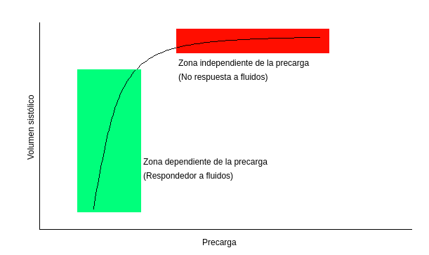
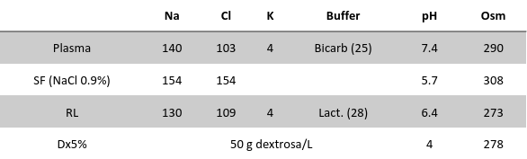

# Manejo de la Fluidoterapia Intravenosa

Objetivos:

- Entender a los fluidos IV como drogas
    - Indicaciones
    - Contraindicaciones
    - Dosificación y elección del tipo de fluidos
    - Efectos adversos
- Adquirir herramientas para su uso racional

## Disposición de los fluidos en el organismo

Compartimentos:

- Intravascular 10%
- Extravascular
    - Intracelular 60%
    - Intersticial 20%
    - Tercer espacio

## ¿Cuándo es necesario el aporte de fluidos intravenosos?

Básicamente cuando no podemos lograr el aporte requerido de líquido por el paciente por la vía oral, ya sea por requerir reanimación (la velocidad de absorción no es la suficiente) como por intolerancia a la VO. Entonces:

**Indicaciones**

- Reanimación
- Reposición
- Mantenimiento
- Nutrición

## ¿Qué tipos de fluidos existen?

- Cristaloides: solución con componentes que atraviesan libremente la pared vascular. 
    - Ringer lactato
    - Solución fisiológica
    - Dextrosado (no es de utilidad para expandir el volumen intravascular debido a que la dextrosa es metabolizada rápidamente, con lo que solo aporta agua libre)
- Coloides: contiene componentes que permanecen por mayor tiempo en el intravascular, con el beneficio teórico de aportar presión oncótica y una mayor expansión del intravascular y menores pérdidas al intersticial
    - Semisintéticos
    - Albúmina
    - Hemoderivados (plaquetas, plasma, rojos...)

### Solución fisiológica
Se relaciona con el desarrollo de acidois hiperclorémica (por la elevada carga de cloro que posee) y posiblemente con injuria renal aguda, con lo cual suelen ser preferibles los cristaloides balanceados como Ringer Lactato.

### Ringer Lactato
Se debe tener precaución en insuficiencia hepática debido a la dificultad para metabolizar el lactato a nivel hepático. Se debe evitar en pacientes con TEC (o algún otro factor de riesgo para hipertensión endocraneana) ya que al ser levemente hipoosmolar puede favorecer el desarrollo de edema cerebral. 

### Coloides semisintéticos
Se asocian a daño renal y no han logrado demostrar beneficios por sobre los cristaloides.

Albúmina y hemoderivados tienen indicaciones puntuales, y no son fluidos que vayan a utilizarse por fuera de las mismas.

# Reanimación

La reanimación con fluidos implica administrar volumen en forma rápida, con el objetivo de aumentar la precarga para lograr optimizar la función de bomba. 

> La precarga es el estiramiento inicial de la fibra miocárdica, que se traduce en presión y volumen de fin de diástole. 

Es importante entender entonces la base fisiopatológica: la *ley de Frank-Starling*, que plantea que el volumen sistólico aumenta con el aumento de la precarga.  Esto es así dentro de ciertos límites; si se sobrecarga al ventrículo deja de responder y eventualmente comienza a fallar. Así los pacientes pueden dividirse en respondedores a fluidos y no respondedores.

Graficándolo en una curva de Starling de función ventricular:

*Figura 1: curva de función ventricular (de Starling)*

La mayor parte de los pacientes con descompensación hemodinámica presentan un déficit inicial de fluidos, con lo cual por lo general, serán respondedores a fluidos. Con una adecuada reanimación inicial, este déficit se repone, y muchos de estos pacientes pasarán a ser no respondedores.

Por otro lado, hay pacientes que presentan muy baja tolerancia a los incrementos de precarga: aquellos con insuficiencia cardíaca, enfermedad renal... En estos pacientes la reanimacion con volumen debe ser sumamente precavida para evitar la sobrecarga y efectos adversos.

Entonces, en la reanimación debe tenerse en cuenta:

- Déficit previo
- Capacidad de respuesta a fluidos
- Tolerancia al volumen

## Bolo de fluidos

Se considera una expansión o bolo de fluidos:

- Volumen 4 ml/kg o más (en general 500-1000 ml)
- Velocidad (pasa como máximo en 30 min)
- Composición: cristaloides isotónicos (Ringer o solución fisiológica)

Posterior a cada expansión deberíamos valorar la respuesta a la misma, evaluando TA, perfusión periférica (relleno capilar, nivel de consciencia), diuresis, y evaluar la tolerancia, buscando signos de sobrecarga (desaturación, crepitantes, ortopnea, ingurgitación yugular, PVC elevada).

En general se acepta como máximo 30 ml/kg para la reanimación inicial (en el paciente séptico) a lo largo de 1-3hs.  **En COVID-19 este volumen puede resultar excesivo y derivar en mayor riesgo de distrés respiratorio, por lo cual se sugiere realizar estrategias conservadoras**

## Parámetros de seguimiento en la reanimación

Objetivos:

- TAS >90 mmHg o un incremento ~10%
- Descenso del láctico 10-20% en 1h o <2 mEq/L (18 mg/dL)
- Diuresis >0,5 ml/kg/h 
- Normalización de la FC y FR
- Mejoría del sensorio

Tener en cuenta que no siempre se pueden alcanzar todos los objetivos: el clearence del láctico puede entorpecerse por falla hepática o renal, la diuresis puede estar afectada por una IRA de otra etiología, el sensorio puede alterarse por otras causas.

### La PVC

La presión venosa central es una medición indirecta de la precarga. Su valor normal oscila entre 0-5 mmHg (0-7 cmH2O). Si bien se ha utilizado para guiar la reanimación con fluidos históricamente, no es un buen predictor:

- No es un reflejo fidedigno de las presiones ventriculares: la PVC varía a lo largo del ciclo cardíaco, y solo en el fin del llenado ventricular la PVC equivale a la precarga.
- No puede predecir cómo responderá el corazón a una expansión: dado que no puede reflejar en qué momento de la curva de Starling se encuentra el paciente
- La PVC "baja" es NORMAL: las cavidades derechas manejan bajas presiones de llenado, cercanas a 0, con lo cual encontrar presión de 0 (PVC aspirativa) es normal.

# Reposición

La reposición implica considerar déficits previos y pérdidas continuadas. Para esto debe tenerse en consideración las características de los fluidos que se pierden por un lado, y el volumen de los mismos, y debería reponerse tratando de igualarlos, para evitar alteraciones hidroelectrolíticas.

*Figura 2: composición de los cristaloides habituales*

> La composición de distintos fluidos corporales puede verse en [este link](https://www.nice.org.uk/guidance/cg174/resources/diagram-of-ongoing-losses-191664109).

# Mantenimiento

**Requerimientos diarios**

- Volumen: 25-30 ml/kg
- K y Na: 1 mEq/kg
- Dextrosa / Glucosa: 1,5 g/kg (50-100 g)

El volumen debe ajustarse al peso teórico en pacientes obesos. Debe descontarse de su cálculo otros aportes "obligatorios" (medicación diluida por ejemplo); no se descuentan los aportes de reposición ni reanimación. 

En pacientes ancianos, frágiles, con ERC o IRA, ICC, malnutridos, o con riesgo de sindrome de realimentación, debe considerarse reducir el volumen aportado (20ml/kg/día) para evitar efectos adversos, ya que estos pacientes son más intolerantes al aporte de volumen.

> Es de notar que la Solución Fisiológica no es un buen fluido de reposición (exceptuando tal vez las pérdidas por vómitos o SNG a descarga), ni de mantenimiento, ya que difiere sustancialmente de los líquidos corporales.

# Lecturas

- Ann Intensive Care. 2018;8(1):66. doi:[10.1186/s13613-018-0402-x](https://doi.org/10.1186/s13613-018-0402-x)
- NICE Clinical guideline 174 (2017) [https://www.nice.org.uk/guidance/cg174](https://www.nice.org.uk/guidance/cg174)

Versión: 13/04/2020
